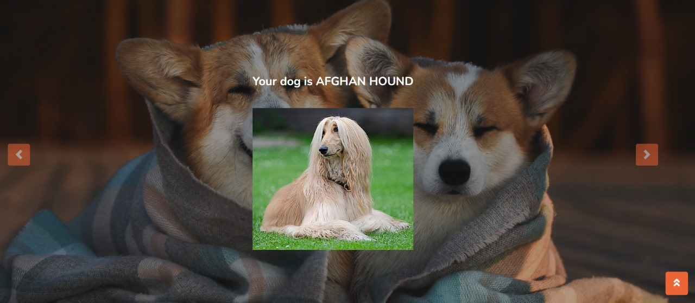
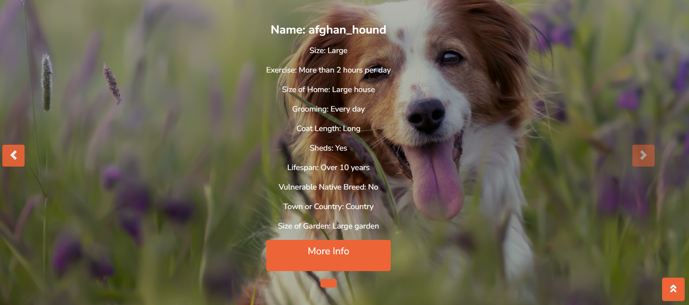
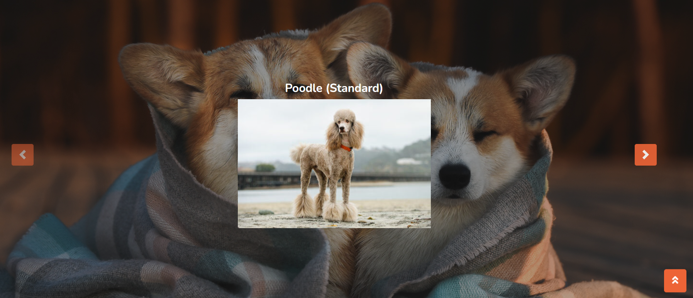

# Dog-Breed-Identofocation-Recommendation
Engineered a web application using deep learning for accurate dog breed identification and implemented a recommendation feature. Users can upload dog photos, and the model not only identifies the breed but also suggests ideal breeds based on user profiles.    Achieved 89% testing accuracy, showcasing the effectiveness of the identification model.


## Features
- **Breed Identification:** Upload a photo, and our deep learning model accurately identifies the dog breed.
- **User-Friendly Interface:** Intuitive web interface for easy photo uploads and interaction.
- **Breed Recommendation:** The application suggests ideal dog breeds based on user profiles and preferences.


# Install Dependencies
<b>Run command :
```bash 
pip install -r requirements.txt
```


# Run the Django App
<b>Run command :
```bash 
python manage.py runserver
```

 ## Dataset
 
 ```bash
http://vision.stanford.edu/aditya86/ImageNetDogs/
```
- Number of categories: 120
- Number of images: 20,580
- ~150 images per class
- Annotations: Class labels, Bounding boxes


# Implementation

## Inception V3 for Dog Breed Classification

### Model Overview

- **Inception V3:** Pre-trained CNN for image classification.
- **Google-developed:** Excels in recognizing intricate patterns.
- **Trained on diverse dog breed images:** Accurately categorizes input into specific breeds.
- **Transfer Learning:** Utilized pre-trained Inception V3 weights.
- **Fine-Tuning:** Custom dataset fine-tuning for breed accuracy.
- **Adaptability:** Designed for potential future breed expansion.

## Cosine Similarity for Personalized Dog Recommendations

### Approach Overview

- **Cosine Similarity:** Measures the cosine of the angle between two vectors.
- **Data Collection:**
  - **Source:** Scraped data from AKC Dog Breeds website.
  - **Objective:** Gathered comprehensive information on various dog breeds for training the model and providing detailed breed profiles.
- **User-Centric Recommendations:**
  - Tailored recommendations based on user input.
  - Factors in size, temperament, and exercise preferences.
  - Dynamic Adjustment: Algorithm adjusts to evolving user preferences.

 <p>
    <h3>Prediction</h3>
    <span>   </span>
  <br>
  <br>
    <h3>Recommendation</h3>
    
    
</p>	


